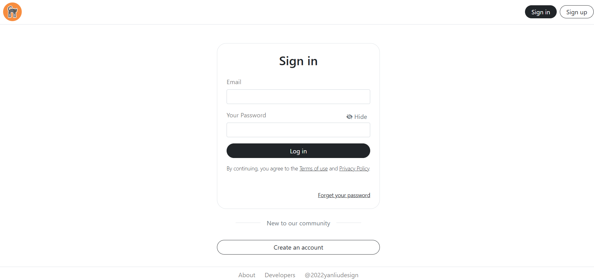
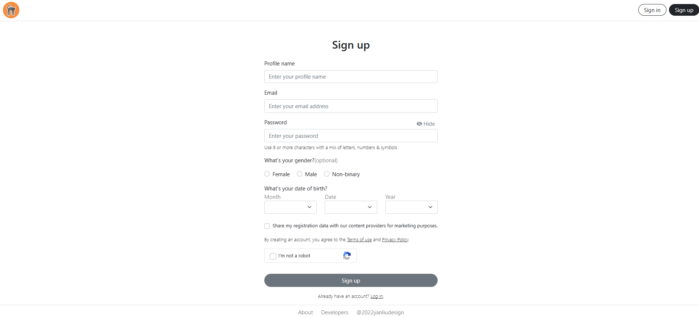

# Login e Cadastro - Desenvolvimento de Interfaces
Este projeto consiste em telas de Login e Cadastro desenvolvidas com HTML, CSS, JavaScript e Bootstrap.   As interfaces seguem o design do @2022yanliudesigns.

Tecnologias Utilizadas:
- Html
- CSS
- JavaScript
- Bootstrap

Funcionalidades e Validações:
- Formato de e-mail
- Características de senha
- Verificação de data válida
- Submit de formulário ocorre apenas com preenchimento dos dados obrigatórios, no cadastro

Login

Cadastro

